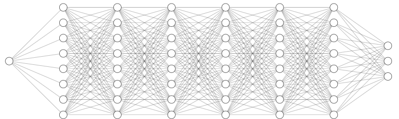
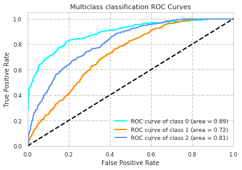

# Deep Learning Mortality Prediction :robot: :computer: :skull:

Undergraduate Project for Biomedical Engineering degree @ UPC Barcelona.

Designed using Keras in Python 3.6 Anaconda. 

MIMIC III v1.4 database analysis

Prediction of extra-hospital mortality in critic patients using artificial neural networks. 

MIMIC-III (Medical Information Mart for Intensive Care III) is a large, freely-available database comprising deidentified health-related data associated with over forty thousand patients who stayed in critical care units of the Beth Israel Deaconess Medical Center between 2001 and 2012.

The database includes information such as demographics, vital sign measurements made at the bedside (~1 data point per hour), laboratory test results, procedures, medications, caregiver notes, imaging reports, and mortality (both in and out of hospital).

A neural network was created using the following features:
* Demographical features
  * Age
  * Gender
  * Marital status
  * Religion
  * Ethnicity
  
* Lab Tests
  * Blood urea nitrogen
  * Platelet count
  * Hematocrit
  * Potassium
  * Sodium
  * Creatinine
  * Bicarbonate
  * White blood cells count
  * Glucose
  * Albumin
  
* Vital Signs
  * Heart rate
  * Respiratory rate
  * Systolic pressure
  * Diastolic pressure
  * Temperature
  * Oxygen Saturation
  
* Administrative data
  * Admission medical service
  * ICD 9 Diagnostic code
  * Performed surgeries count
  * ICU length of stay
  * Total length of stay
  * OASIS, SAPS and SOFA severity scores
  * Time under mechanical ventilation
  * Medical procedure count

Created neural network able to classify critical patients mortality in three groups with overall 0.82 AUROC

* < 1 month mortality: 0.89 AUROC, 0.79 accuracy
* 1 - 12 months mortality: 0.72 AUROC, 0.47 accuracy
* \> 1 month mortality: 0.81 AUROC, 0.57 accuracy

Medium Article : https://medium.com/@daniel.sola.fraire/predicting-patient-mortality-with-deep-learning-f9814bf192da
Full Thesis: https://github.com/DanielSola/mimic-iii-project/blob/master/deep_learning_thesis.pdf

README's and documentation written in Spanish. 
